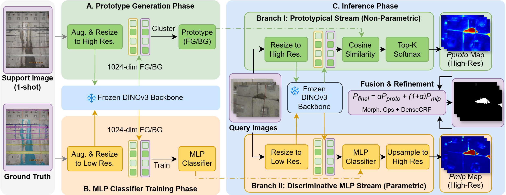

# DOWSER: A DINO-based One-Shot Water Seepage Recognition Network for TBM Tunnel Inspection

[](https://github.com/zxy239/xxxx)
[](https://pytorch.org/)
[](https://github.com/zxy239/xxxx)

Official implementation of **DOWSER**, developed by **Team DeepTunnel Seer**. This is for Underground Infrastructure Digital Challenge (UIDC 2026).

DOWSER (**D**INO-based **O**ne-shot **W**ater **S**eepage **R**ecognition) is a sample-efficient framework designed to achieve high-precision water seepage segmentation in TBM (Tunnel Boring Machine) tunnel environments using **only a single annotated sample**.

---

## 📑 Technical Report

### 1. Objective
The industrial deployment of supervised models for structural damage detection in TBM tunnels is fundamentally hindered by the prohibitive cost of continuous data collection and manual pixel-level labeling. Conventional "data-hungry" paradigms are unsustainable in dynamic construction sites. 
**DOWSER** aims to:
* Solve the data scarcity problem in TBM seepage detection.
* Achieve high-precision segmentation (mIoU > 85%) with only **one** reference sample.
* Provide a robust tool for real-time tunnel health monitoring.

### 2. Methodology
Our framework exploits the inherent visual stability of TBM tunnel backgrounds through a **Dual-Stream Architecture** based on a frozen **DINOv3** backbone:

<p align="center">
  
</p>

<p align="center">
  <em>Figure 1. Overview of the DOWSER network.</em>
</p>

* **Encoder:** A frozen DINOv3 backbone provides high-level semantic features without the need for extensive training on tunnel-specific data.
* **Prototypical Stream:** A non-parametric stream that extracts a representative "prototype" from the support image to identify similar patterns in the query image.
* **MLP Stream:** A parametric Multilayer Perceptron stream that refines the coarse segmentation, ensuring precise boundary detection where water meets the rock/lining surface.

### 3. Findings
* **Accuracy:** DOWSER achieves a remarkable **86.42% mIoU** in one-shot scenarios.
* **Comparative Advantage:** It trails the fully supervised baseline (trained on 571 images) by **less than 5%**, proving that "less is more" when using the right architecture.
* **Efficiency:** The dual-stream approach only required very tiny training.

---

## 👥 Authors & Team Information

**Team Name:** DeepTunnel Seer

* **Zehao Ye** (University of Birmingham, UK / Durham University, UK)
* **Neng Wang** (University College Cork, Ireland)
* **Huamei Zhu** (Durham University, UK)

---

## 🛠️ Installation & Usage

### Prerequisites
* Python 3.9+
* PyTorch 2.0+

```bash
# Clone the repository
git clone [https://github.com/zxy239/DOWSER.git](https://github.com/zxy239/DOWSER.git)
cd xxxx

# Install dependencies

pip install torch torchvision opencv-python numpy matplotlib


